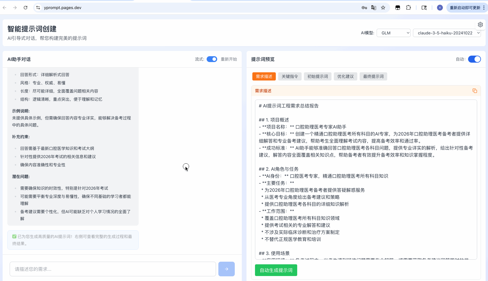
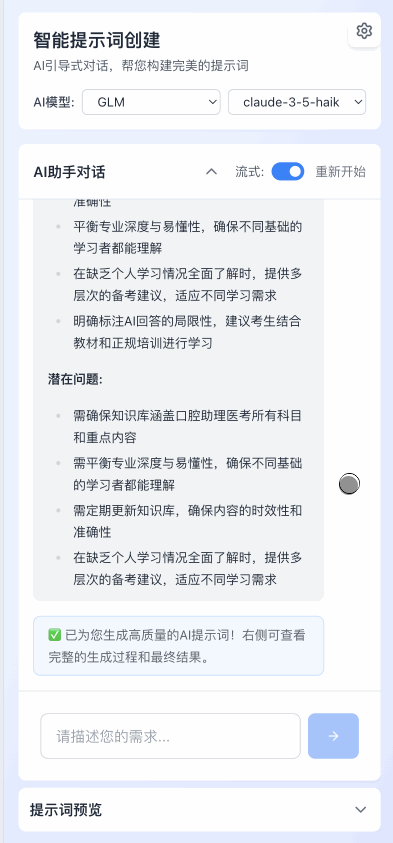

# YPrompt - 智能提示词生成工具

基于AI对话引导挖掘用户需求的专业提示词生成系统，基于《Architecting Intelligence: A Definitive Guide to the Art and Science of Elite Prompt Engineering》理论生成高质量的AI提示词。

## 一键部署

在 Github 上先[](https://github.com/fish2018/YPrompt/fork)本项目，并点上 Star !!!

[](https://vercel.com/new/clone?repository-url=https://github.com/fish2018/YPrompt&build-command=npm%20run%20build&install-command=npm%20install&output-directory=dist)

**Vercel 部署步骤**
1. Fork 本仓库到您的 GitHub 账户
2. 登录 Vercel，点击 "New Project"
3. 导入您的仓库
4. 配置构建参数：
   - Install Command: `npm install`
   - Build Command: `npm run build`
   - Output Directory: `dist`
5. 点击 "Deploy"

## 截图
**PC端**  
  


**移动端**  



## 核心功能

- **AI引导式需求收集**: 通过智能对话深入挖掘用户真实需求
- **GPrompt四步生成**: 关键指令提取 → 初始提示词 → 优化建议 → 最终提示词
- **多AI模型支持**: 支持OpenAI、Anthropic、Google Gemini和自定义AI服务商
- **双模式操作**: 自动生成和手动步进两种执行模式
- **格式语言转换**: 支持Markdown/XML格式切换和中英文互译
- **响应式设计**: 完美适配桌面端和移动端设备
- **支持内置提供商**: 将 `builtin-providers.example.json` 复制为 `builtin-providers.json` 并修改您需要的配置即可。

## 技术栈

- **前端框架**: Vue 3 + TypeScript
- **构建工具**: Vite
- **UI框架**: Tailwind CSS
- **状态管理**: Pinia
- **图标库**: Lucide Vue Next
- **Markdown**: Marked

## 项目结构

```
src/
├── components/          # Vue组件层（已完成模块化重构）
│   ├── ChatInterface.vue         # 对话界面主容器 (196行)
│   ├── PreviewPanel.vue          # 预览面板主容器 (257行)
│   ├── SettingsModal.vue         # 设置弹窗主容器 (139行)
│   ├── PromptGenerator.vue       # 提示词生成器
│   ├── NotificationContainer.vue # 通知容器
│   ├── chat/                     # 对话模块
│   │   ├── composables/          # 业务逻辑组合式函数
│   │   │   ├── useChatMessages.ts
│   │   │   ├── useChatInput.ts
│   │   │   ├── useChatAttachments.ts
│   │   │   ├── useChatModel.ts
│   │   │   ├── useChatQuickReplies.ts
│   │   │   ├── useChatMessageOperations.ts
│   │   │   └── useChatLogic.ts
│   │   └── components/           # UI子组件
│   │       ├── ChatHeader.vue
│   │       ├── ChatModelSelector.vue
│   │       ├── ChatMessageList.vue
│   │       ├── ChatMessage.vue
│   │       ├── ChatQuickReplies.vue
│   │       └── ChatInputArea.vue
│   ├── preview/                  # 预览模块
│   │   ├── composables/          # 业务逻辑组合式函数
│   │   │   ├── usePreviewTabs.ts
│   │   │   ├── usePreviewExecution.ts
│   │   │   ├── usePreviewConversion.ts
│   │   │   ├── usePreviewScrollSync.ts
│   │   │   ├── usePreviewClipboard.ts
│   │   │   ├── usePreviewListOperations.ts
│   │   │   └── usePreviewHelpers.ts
│   │   └── components/           # UI子组件
│   │       ├── common/
│   │       │   ├── PreviewHeader.vue
│   │       │   ├── TabContainer.vue
│   │       │   ├── TabButton.vue
│   │       │   ├── EmptyState.vue
│   │       │   └── LoadingState.vue
│   │       └── tabs/
│   │           ├── ReportTab.vue
│   │           ├── ThinkingTab.vue
│   │           ├── InitialTab.vue
│   │           ├── AdviceTab.vue
│   │           └── FinalTab.vue
│   └── settings/                 # 设置模块
│       ├── composables/          # 业务逻辑组合式函数
│       │   ├── useProviderManagement.ts
│       │   ├── useModelManagement.ts
│       │   ├── useModelTesting.ts
│       │   └── usePromptRules.ts
│       └── components/           # UI子组件
│           ├── SettingsButton.vue
│           ├── SettingsHeader.vue
│           ├── tabs/
│           │   ├── ProvidersTab.vue
│           │   └── PromptsTab.vue
│           └── dialogs/
│               ├── ProviderTypeDialog.vue
│               ├── ProviderDialog.vue
│               └── ModelDialog.vue
├── stores/              # Pinia状态管理
│   ├── promptStore.ts           # 提示词生成状态
│   ├── settingsStore.ts         # AI配置和应用设置
│   └── notificationStore.ts     # 通知状态
├── services/            # 业务服务层（已完成模块化重构）
│   ├── aiService.ts             # AI服务统一入口 (185行)
│   ├── aiGuideService.ts        # AI引导式需求收集
│   ├── promptGeneratorService.ts # GPrompt四步生成
│   ├── capabilityDetector.ts    # 模型能力检测
│   └── ai/                      # AI服务模块化实现
│       ├── providers/           # 提供商实现
│       │   ├── BaseProvider.ts
│       │   ├── OpenAIProvider.ts
│       │   ├── AnthropicProvider.ts
│       │   └── GoogleProvider.ts
│       ├── streaming/           # 流式处理
│       │   ├── StreamProcessor.ts
│       │   ├── SSEParser.ts
│       │   └── StreamFilter.ts
│       ├── multimodal/          # 多模态转换
│       │   ├── AttachmentConverter.ts
│       │   ├── OpenAIAttachmentHandler.ts
│       │   ├── AnthropicAttachmentHandler.ts
│       │   └── GoogleAttachmentHandler.ts
│       ├── errors/              # 错误处理
│       │   ├── AIErrorHandler.ts
│       │   └── ErrorParser.ts
│       ├── utils/               # 工具函数
│       │   ├── ResponseCleaner.ts
│       │   ├── ModelFetcher.ts
│       │   └── apiUrlBuilder.ts
│       ├── types.ts             # 类型定义
│       └── index.ts             # 模块导出
├── config/              # 配置文件
│   ├── prompts.ts              # 提示词配置管理
│   └── prompts/                # 内置提示词规则
│       ├── systemPromptRules.ts
│       ├── thinkingPointsExtraction.ts
│       ├── optimizationAdvice.ts
│       └── userGuidedRules.ts
├── utils/               # 通用工具函数
│   ├── aiResponseUtils.ts
│   └── fileUtils.ts
├── views/               # 页面视图
│   └── HomeView.vue
└── main.ts              # 应用入口
```